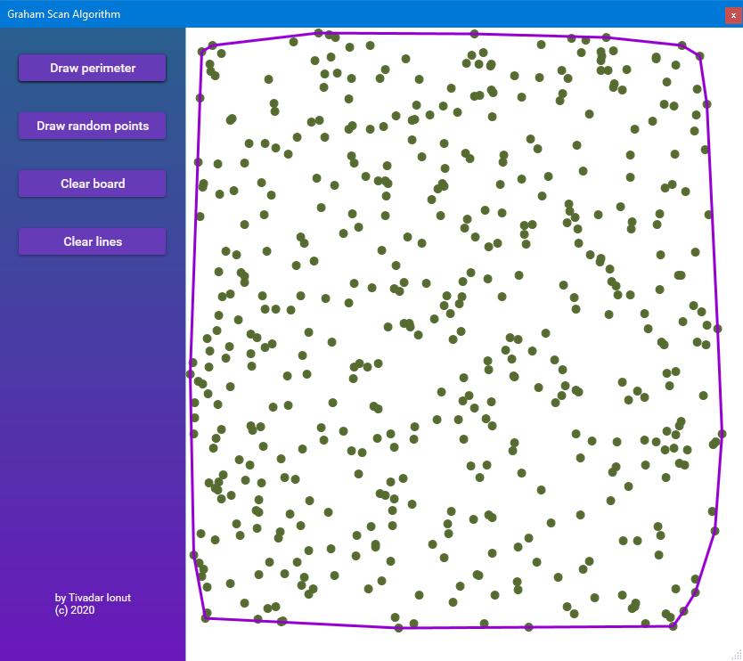

# Graham-Scan-GUI
Being being passionate about algorithms and data structures, I always look for opportunities to implement new ideas in this area.

 The app is an visualization in a user-friendly interface  of the Graham scan algorithm. It is implemented in WPF technology with the MVVM architecure in mind.

##### [More screenshots below](#Screenshots)
# The convex hull problem
In geometry, the convex hull (or convex closure) of a shape is the smallest convex region that contains that shape. In other words, the convex hull of a set of points is the smallest shape that includes all the points. The points might be situated in the interior of the shape or exactly on boundary. In this case, the shape is defined by the edges between the points on the convex hull. 

The convex hull problem is reduced to finding the points which will shape the convex hull in a optimal way. More info on the [Wikipedia](https://en.wikipedia.org/wiki/Convex_hull).

# The Graham's scan algorithm
The [Graham's scan](https://en.wikipedia.org/wiki/Graham_scan) is a method of solving the convex hull problem. The method is very efficient as it has the time complexity of _O(n log n)_ with _n_ being the number of vertices on the plane. The algorithm finds all the vertices along the boundary of a shape or a set of points. It uses a stack to ignore efficiently the vertices which are not on boundary.

## Steps

We consider that the **_n_** is the number of points, and the **_allPoints[]_** of length _n_ is the input array. The points in the array are defined by X and Y coordinates. 

1. Creates an empty stack which will contains the points on the convex hull.
2. If the **_n_** is less or equal to 2, we add these points to the stack and returns it. 
3. Find the bottom-most point by comparing Y coordinate of all points. If multiple points have the same Y coordinate, consider the point with the smaller X coordinate. We will name this point **P0**. it is guaranteed that this point is on the convex hull and we move on the first position in the **allPoints[]** array.
4.   Sort in-place the remaining n-1 points by the polar angle in couunterclockwise order with the respect of **P0**. In case of two points having the same polar angle, the nearest point from point **P0** is placed before the other one. 
5. Push into the stack the points at position **0 and 1** from the **allPoints[]** array.
6. For each reamining point in the array starting at position **2** apply the step **7**.
7. Determines if travelling from the last two points from the stack to the current point constitutes making a left turn or a right turn. In case of a right turn, the second to last point is not part of the convex hull.  If a left turn is made then the point is pushed in the stack.
8. Returns the stacks which now contains all the points on the boundary of the shape. 
# Applications
The Graham's scan method can be used in some do domains as:

* Collision avoidance in automation driving. 
* Finding shortest path.
* Shape analysis.
* Image processing.

# How to use the app
The UI design have two components: the menu on the left, and the blank canvas on the right. The white canvas let users to draw points at the cursor position when a click is made in that area.

What does this button do?
* __Draw perimeter__  - Computes the convex hull of the vertices from the canvas and draw the edges on the canvas.
* __Draw random points__  - Draws 500 points random distributed on the canvas. 
* __Clear board__ - Clears the board of all points and edges. Restores its blank state.
* __Clear lines__ - Clears the edges of the convex hull from the canvas. Keeps the points. 

# Screenshots
Points before solving the convex hull:

The solved convex hull of points from previous image:

The solved convex hull random points:

